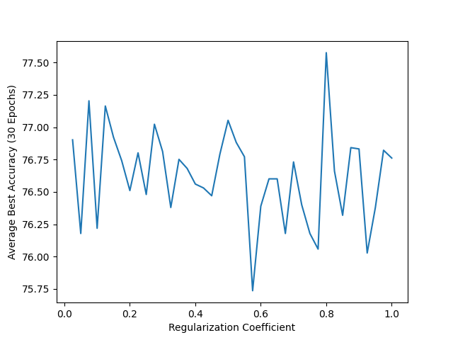
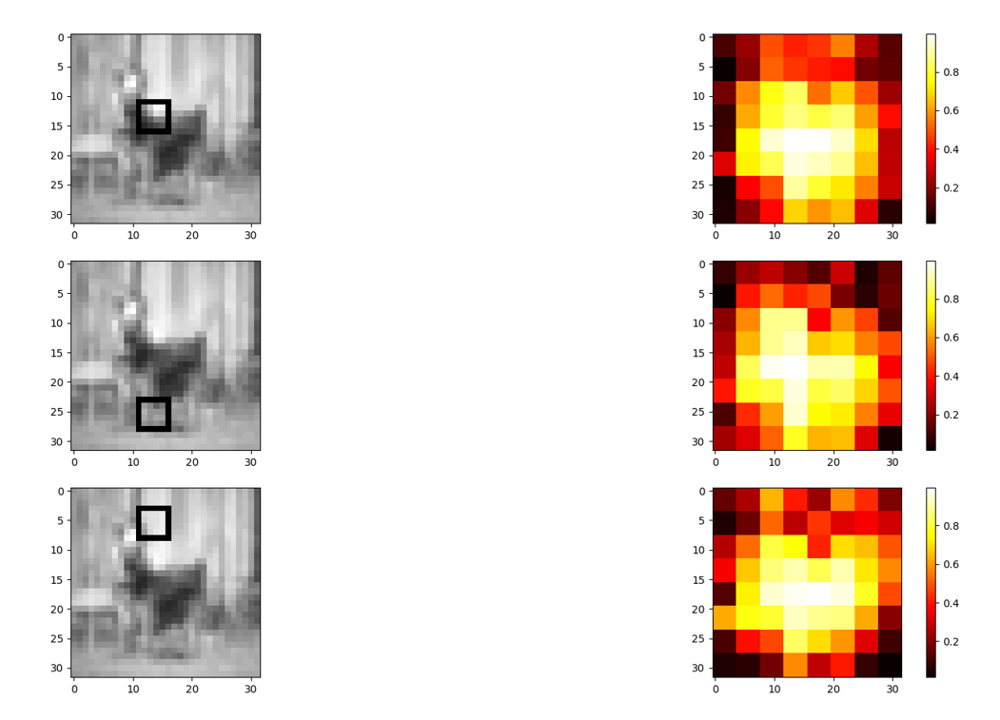

# <u>Self-Optimal Transport Usage in Visual Transformers</u>
We were assigned with the task of integrating the SOT algorithm in the attention mechanism in a transformer NN.  
In order to evaluate the differences we chose a [Compact Transformer](https://account.jetbrains.com/github/oauth/intellij/authorize?code_challenge=3y%2Bj7z1INw%2FWRw6ILR6YFi1QXCV5R7GcsQ1JLTD2Ygk%3D&callback_url=http%3A%2F%2F127.0.0.1%3A63342%2Fapi%2Fgithub%2Foauth%2Fauthorization_code) (namely, Convolutional Compact Transformer/CCT with 2 heads) with short training time.   
We have used Daniel Shalam's & Simon Korman's [Self-Optimal Transport](https://github.com/DanielShalam/SOT) code and have modified it a bit to support input of 2 tensors.

## Testing SOT usage
We tried various ways to combine the SOT with the Attention mechanism,  
more briefly, we have tried 3 different ways to use the SOT:


### <u>Before changing the attention</u>
The original way the attention was calculated was as follows:

```python
attn = (q @ k.transpose(-2, -1))
```

Where Q and K are two of the three vectors in the attention mechanism.

<b>This achieved 78.14% accuracy at best</b>

***
### <u>After changing the attention</u>
The various ways we later tried to use were as follows:

<b>It's worth to mention that the entropy regularization coefficient for  
the following results was 0.1 (default)</b>.  
More about the Softmax part later.

* `Attention = SOT(Q)`
<b>76.65%</b>
* `Attention = SOT(Q)(Without Softmax)`
<b>74.96%</b>
* `Attention = SOT(Q, K)`
<b>75.14%</b>
* `Attention = SOT(Q, K)(Without Softmax)`
<b>76.88%</b>
* `Attention = SOT(Q, K.T)`
<b>76.76%</b>

### <u>Overfitting</u>
The levels of overfitting seem to be similiar in both cases but we believe there's room for further analysis.
In the trainTest notebook the difference of accuracy between train and test time can be seen.

### <u>Testing SOT With Different Regularization Coefficients</u>
We have ran a test to see whether different regularization coefficients achieved  
worse/better results and whether we can beat our previous results.

The test ran 5 times for each coefficient on the [0.025, 1] interval with a step size of 0.025 using the SOT(Q,K) variant:

The graph represents the average best accuracy of the model for each coefficient.

* We can definitely see that the results are very close to the original attention mechanism results, around 77-78%.  
* It's safe to assume that running the above experiment many times will provide a smoother graph.
***

## Visual Results

### <u> Histograms & Heatmaps of Attention Weights </u>

We have selected a random tensor inside the input in a random batch and wanted  
to see the attention inside it visually so we have made a heatmap for the attention weights  
and also have visualized the distribution of the attention weights.

It's important to mention that for the first and third histograms the x-axis was fixed in contrast to the second and fourth one
where the x coordinates were so small we had to give it automatic scaling in order to understand what is going on.

- The softmax graphs were very sensitive and hard to plot so we have applied a log function on the values to present a better plot (this applies to second and fourth graphs)


For the same problem from the histogram section, the heatmap for the second and fourth ones was weird but for
a good reason, since we have a big cluster of points in the 0.0175 area and a small cluster in the 0 area 
the difference between the two should be very clear, this is why we see a lot of black points (0) and a big area of
yellow-ish points that represnt the cluster in the 0.0175 area.

#### <u> SoftMaxing the SOTed Tensors </u>
In previous section we showed 2 versions of the experiment: with and without performing SoftMax on the result.
Before SoftMax the tensor has a typical look of SOTed features - symmetric and with dense diagonal.    
Even though SOT outputs positive values, since every row counts to 2, SoftMax is still needed. Nevertheless, we experimented without SoftMax and the results were
better in one case and worse in the other.

### <u> Heatmap of specific patches </u>

The next images show how the attention weights per patch (there are 64 patches of size 4*4) look like with and without SOT.
It can be seen that whilst in the general case the location of the patch has only a subtle influence on the attention, when applying SOT however it gets very different due to nature of SOT which attributes more weight to areas that are similiar. Also, the patch itself is allways wight for the same reason.
Since the images are of size 32*32 pixels only, it's recommended to zoon-in and discover the content of the image.

#### <u> Without SOT </u>


#### <u> With SOT(Q) </u>
.png)
For example, in the third patch, the attention is awarded to the ceiling/background of the image (probably) because it is the most similiar part

#### <u> With SOT(Q, K) </u>
.png)  
Indeed, some of the heatmaps are less explainable


***

## How to Run

```bash
  python main.py --ot 0.1 --model cct_2 --conv-size 3 --conv-layers 2 --print-freq -1 --epochs 30 --workers 1 cifar10/
```

You may change the arguments to your liking, the provided command is what we used in our experiments when using the default regularization coefficient
(the ot argument)


